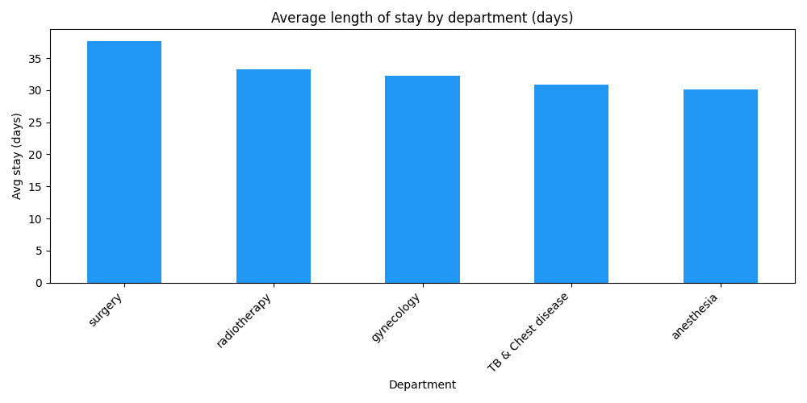
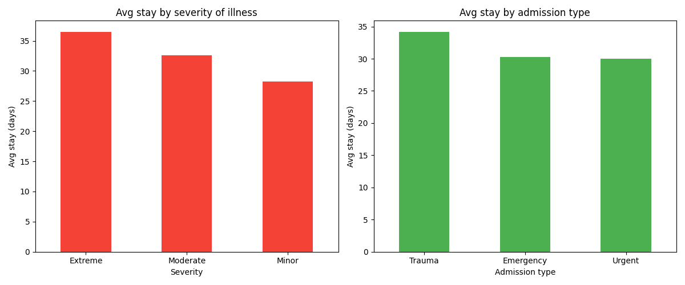
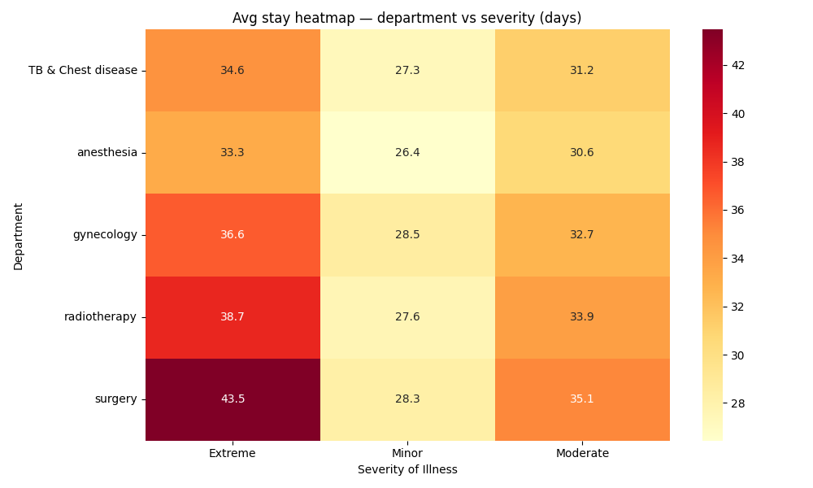
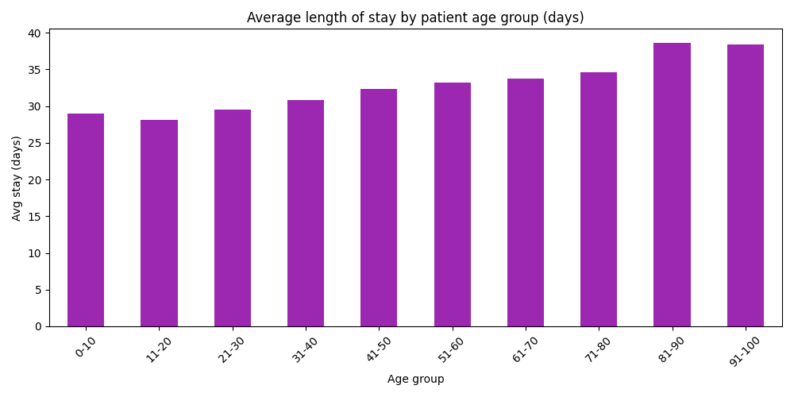

# Patient Wait Time Analysis

## Overview
Analyzed 318,438 patient records across 5 hospital departments
to identify key drivers of extended hospital stays and surface
bottlenecks for operational improvement.

## Business Question
Which departments, patient profiles and admission types lead
to the longest hospital stays — and where are the biggest
bottlenecks?

## Dataset
- Source: Healthcare Analytics Dataset (Kaggle)
- 318,438 patients | 18 columns | 5 departments
- Link: kaggle.com/datasets/nehaprabhavalkar/av-healthcare-analytics-ii

## Tools Used
- Python (Pandas, Matplotlib, Seaborn) — analysis and visualization
- VS Code — development environment
- Git & GitHub — version control

## Key Findings
1. Surgery is the biggest bottleneck at 37.6 avg days —
   25% longer than Anesthesia at 30.1 days
2. Extreme cases stay 8 days longer than Minor cases
   (36.5 vs 28.2 days) — severity is a strong predictor
3. Trauma admissions require the most resources at 34.2
   avg days vs 30.0 days for Urgent admissions
4. Older patients stay significantly longer — 81-90 age
   group averages 38.6 days vs 28.1 days for 11-20 year
   olds, a 37% difference
5. Number of visitors is the strongest stay predictor —
   patients with 25+ visitors average 110 days, indicating
   a direct link between social support needs and severity
6. Admission deposit has virtually zero correlation with
   stay length (-0.052) — pricing policy does not reflect
   actual resource usage

## Recommendations
1. Prioritize Surgery department capacity planning —
   it has the highest avg stay and worst bottleneck
   (Surgery + Extreme = 43.5 avg days)
2. Create an age-based care pathway for patients over
   80 — they stay 37% longer and need dedicated resources
3. Review trauma admission protocols — trauma patients
   stay 4 days longer than urgent cases on average
4. Redesign deposit pricing model to reflect actual
   stay length — current pricing has no correlation
   with resource consumption

## Visualizations

## Project Structure
Healthcare_analytics/
├── train_data.csv               ← raw data
├── wait_time_analysis.py        ← analysis script
├── images/
│   ├── avg_stay_by_dept.png
│   ├── stay_by_severity_admission.png
│   ├── heatmap_dept_severity.png
│   └── stay_by_age.png
└── README.md

## How to Run
1. Clone this repository
2. Install dependencies:
   pip3 install pandas matplotlib seaborn
3. Run the analysis:
   python3 wait_time_analysis.py

## Skills Demonstrated
- Python scripting (Pandas, Matplotlib, Seaborn)
- Numeric mapping of categorical variables
- Correlation analysis
- Multi-variable bottleneck identification
- Heatmap visualization
- Healthcare operations domain knowledge
- Business insight communication
